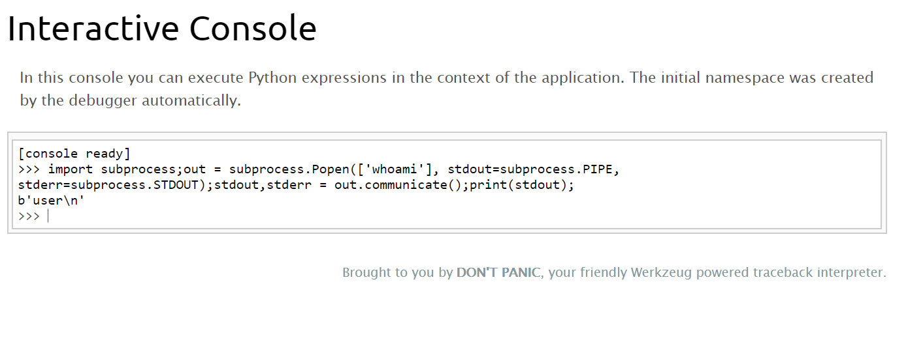

# **H@cktivityCon CTF 2020**

<div align='center'>
  
</div>

This is my writeup for the challenges in H@cktivityCon CTF 2020, I'll try adding as many challenges as I can during the next few days, as of now it contains the only challenge I managed to write about during the CTF.


# Table of Content
* [Web](#web)
  - [Ladybug](#ladybug)
  - [Bite](#bite)
  - [G.I Joe](#g.i-joe)

# Web

## Ladybug
Want to check out the new Ladybug Cartoon? It's still in production, so feel free to send in suggestions!

Connect here:\
http://jh2i.com:50018

**`flag{weurkzerg_the_worst_kind_of_debug}`**

**Solution:** With the challenge we are given a url to a website:


The page seems pretty bare, there are some links to other pages in the webserver and an option to search the website or to contact ladybug using a form, I first tried checking if there's an XXS vulnerability in the contact page or an SQLi vulnerability / file inclusion vulnerability in the search option, that didn't seem to work, then I tried looking in the other pages in the hope I'll discover something there, none of them seemed very interesting, but, their location in the webserver stood out to me, all of them are in the `film/` directory, the next logical step was to fuzz the directory, by doing so I got an Error on the site:


This is great because we now know that the site is in debugging mode (we could infer that also from the challenge description but oh well), also we now know that the site is using Flask as a web framework, Flask is a web framework which became very popular in recent years mostly due to it simplicity, the framework depends on a web server gateway interface (WSGI) library called Werkzeug, A WSGI is a calling convention for web servers to request to web frameworks (in our case Flask).\
Werkzeug also provides a web server with a debugger and a console to execute Python expression from, we can navigate to the console using by navigating to `/console`:

`


From this console we can execute commands on the server (RCE), let's first see which user we are on the server, I used the following commands for that:

```python
import subprocess;out = subprocess.Popen(['whoami'], stdout=subprocess.PIPE, stderr=subprocess.STDOUT);stdout,stderr = out.communicate();print(stdout);
```

the command simply imports the subprocess library, creates a new process which execute `whoami` and prints the output of the command, by doing so we get:



The command worked!, now we can execute`ls` by changing the command in order to see which files are in the current directory, by doing so we see that there's a file called flag.txt in there, and by using `cat` on the file we get the flag:


**Resources:**
* Flask: https://en.wikipedia.org/wiki/Flask_(web_framework)
* Flask RCE Debug Mode: http://ghostlulz.com/flask-rce-debug-mode/

## Bite
Want to learn about binary units of information? Check out the "Bite of Knowledge" website!

Connect here:\
http://jh2i.com:50010

**`flag{lfi_just_needed_a_null_byte}`**

**Solution:** With the challenge we get a url for a website:


the site is about binary units, a possible clue for the exploit we need to use, it's seems we can search the site or navigate to other pages, by looking at the url we can see that it uses a parameter called page for picking which resource to display, so the format is:

`http://jh2i.com:50010/index.php?page=<resource>`

we possibly have a local file inclusion vulnerability (LFI), as I explained in my writeup for nahamCon CTF:

>  php allows the inclusion of files from the server as parameters in order to extend the functionality of the script or to use code from other files, but if the script is not sanitizing the input as needed (filtering out sensitive files) an attacker can include any arbitrary file on the web server or at least use what's not filtered to his advantage

let's first try including the php file itself, this will create some kind of a loop where the file included again and again and will probably cause the browser to crash...but it's a good indicator that we have an LFI vulnerability, navigating to `/index.php?page=index.php` gives us:


index.php.php? it's seems that the php file includes a resource with a name  matching the parameter given appended to .php, lets try `/index.php?page=index` :


It worked! so we know that we have an LFI vulnerability where the parameter given is appended to a php extension, appending a string to the parameter's value is a common defense mechanism against arbitrary file inclusion as we are now limited only to a small scope of files, hopefully only files that are safe to display, but there are ways to go around this.\
In older versions of php by adding a null byte at the end of the parameter we can terminate the parameter's string, a null byte or null character is a character with the code `\x00`, this character signifies the end of a string in C and as such strings in C are often called null-terminated strings, because PHP uses C functions for filesystem related operations adding a null byte in the parameter will cause the C function to only consider the string before the null byte.

with that in mind let's check if we can use a null byte to display an arbitrary file, to mix things we'll try to include `/etc/passwd`, this file exists in all linux servers and is commonly accessible by all the users in the system (web applications running are considered as users in linux) as such it's common to display the content of this file in order to prove access to a server (as proof of concept), we can represent a null byte in url encoding using `%00`, navigating to `/index.php?page=/etc/passwd%00` gives us:


We can use null bytes!...but where is the flag located?\
At this point I tried a lot of possible locations until I discovered that the flag is located in the root directory in a file called `file.txt` by navigating to `/index.php?page=/flag.txt%00` we get the flag:


**Resources:**
* File Inclusion Vulnerabilities: https://www.offensive-security.com/metasploit-unleashed/file-inclusion-vulnerabilities/
* Payload all the things - File Inclusion: https://github.com/swisskyrepo/PayloadsAllTheThings/tree/master/File%20Inclusion
* Null byte: https://en.wikipedia.org/wiki/Null_character
* Null byte issues in PHP: https://www.php.net/manual/en/security.filesystem.nullbytes.php

## GI Joe
The real American hero!

Connect here:\
http://jh2i.com:50008

**Post-CTF Writeup**\
**`flag{old_but_gold_attacks_with_cgi_joe}`**

**Solution:** With the challenge we get a url to a website about G.I joe's movies called See GI Joe:


By the name of the challenge we can assume it has something to do with Common Gateway Interface or CGI (See GI), Common Gateway Interface are interface specification for communication between a web server (which runs the website) and other programs on the server, this allows webserver to execute commands on the server (such as querying a database), and is mostly used to generate webpages dynamically, this type of communication is handled by CGI scripts which are often stored in a directory called `cgi-bin` in the root directory of the web server.\
Looking around in the web site I didn't find any other interesting thing, but by looking at the headers of the server responses using the inspect tool I discovered that the website is using PHP version 5.4.1 and Apache version 2.4.25, this are quite old versions of both PHP (current version is 7.3) and Apache (current version is 2.4.43) so I googled `php 5.4.1 exploit cgi` and discovered this [site](https://www.zero-day.cz/database/337/), according to it there is a vulnerability in this version which allows us to execute arbitrary code on the server, this vulnrability is often refered to by CVE-2012-2311.\
In more details when providing vulnrable website with a value with no parameter (lacks the `=` symbol) the value is interpreted as options for the php-cgi program which handles communication with the web server related to PHP, the options avaliable are listed in the man page in the resources, so for example by using the -s flag we can output the source code for a php file and so by adding `?-s` to the url for a php file located on a vulnrable server we can view the source code of the file, let's try it on the index page (which is a php file) by navigating to `/index.php?-s` we get the following:


It worked! and we now know that the flag is a file called flag.txt in the root directory of the server, as I mentioned before this vulnerability allows us to execute commands on the server, this can be done by using the -d option, this option allows us to change and define INI entries, or in other words change the configuration files of PHP, we need to change the option `auto_prepend_file` to `php://input`, this will force PHP to parse the HTTP request and include the output in the response, also we need to change the option `allow_url_include` to `1` to allow the usage of `php://input`, so by navigating to `?-d allow_url_include=1 -d auto_prepend_file=php://input` and adding to the HTTP request a php code to execute commands on the system `<?php system(<command>) ?>` we can achieve arbitrary code execution on the server.\
let's try doing that to view the flag, we can use cURL with -i option to include the HTTP headers and --data-binary option to add the php code, in the php code we'll use `cat /flag.txt` to output the content of the file, the command is:

`curl -i --data-binary "<?php system(\"cat /flag.txt \") ?>" "http://jh2i.com:50008/?-d+allow_url_include%3d1+-d+auto_prepend_file%3dphp://input"`

and by executing this command we get the flag:


**Resources:**
* Common Gateway Interface: https://en.wikipedia.org/wiki/Common_Gateway_Interface
* CVE-2012-2311: https://cve.mitre.org/cgi-bin/cvename.cgi?name=CVE-2012-2311
* a detailed explanation on CVE-2012-2311: https://pentesterlab.com/exercises/cve-2012-1823/course
* man page for php-cgi: https://www.systutorials.com/docs/linux/man/1-php-cgi/
